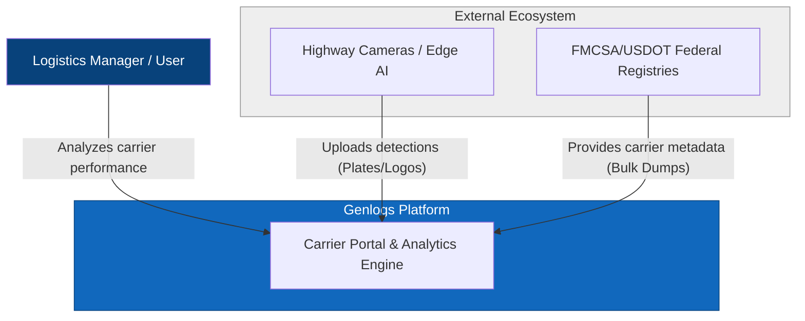
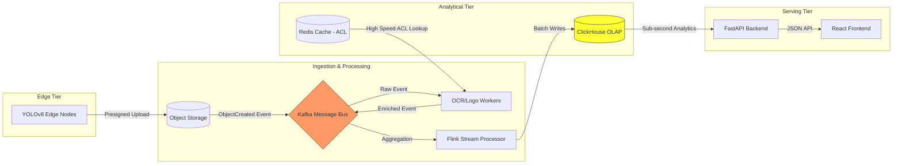
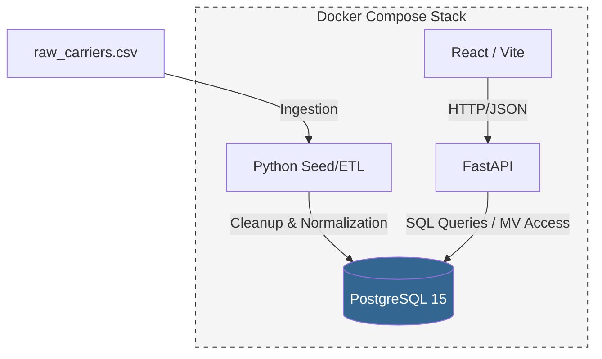
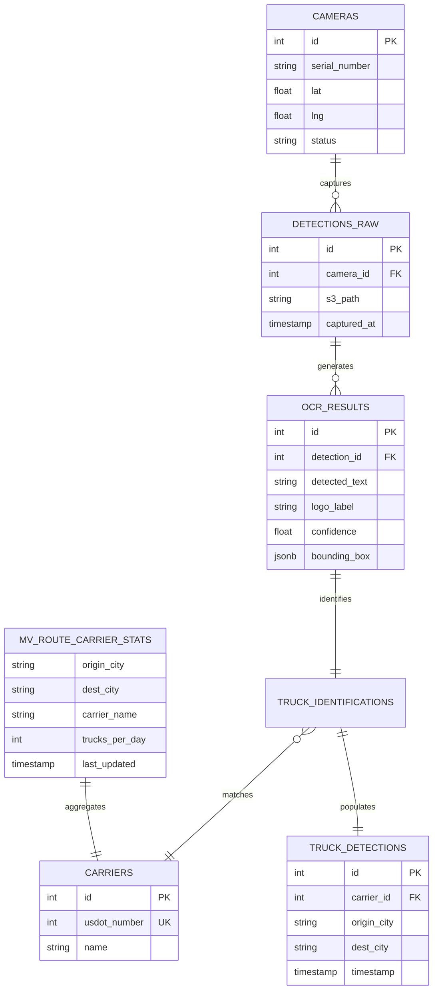

# Genlogs System Architecture Diagrams

This document provides the architectural visual mapping for the Genlogs Carrier Portal, following the **C4 Model** and **Entity-Relationship** standards.

---

## 1. System Context Diagram (C4 Level 1)

This high-level view shows how Genlogs interacts with external actors and government systems.

---

## 2. Container Diagram (C4 Level 2)

### 2.1 Target Production Architecture (National Scale)
Designed for millions of events/day and sub-second analytical latency.

### 2.2 MVP Architecture (Current Prototype)
The pragmatically containerized implementation for this exercise.

---

## 3. Database ER Diagram

The database is optimized using an **Analytical Tier** within PostgreSQL via **Materialized Views**. The full platform also tracks the source and processing tiers.

---

## 4. Key Architectural Decisions

1.  **Anti-Corruption Layer (ACL):** The `seed.py` process acts as the ACL, ensuring that raw, noisy data from external sources is normalized before entering our domain.
2.  **OLAP Simulation:** We use a **Materialized View** (`mv_route_carrier_stats`) to pre-calculate carrier rankings. This avoids expensive `COUNT(DISTINCT)` joins on large datasets during user requests.
3.  **Zero-Trust Sanitization:** All user inputs (Origin/Destination) are sanitized via regex and normalized to lowercase to prevent injection and ensure cache hits.
