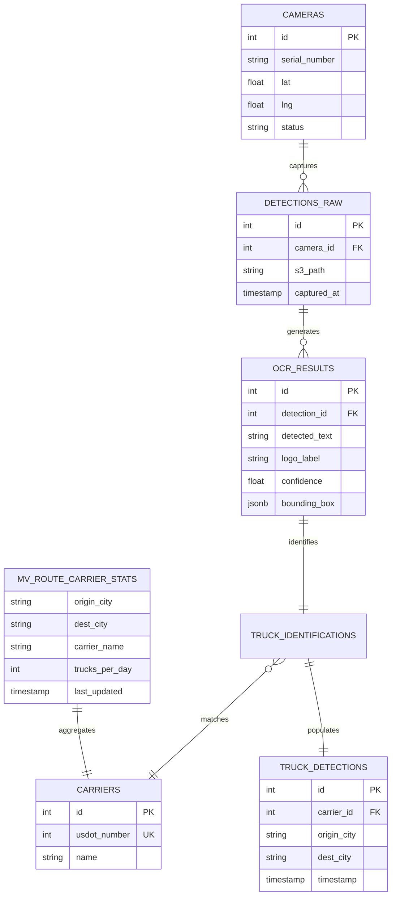

# Enhanced City Selection & Platform ER Diagram Implementation Plan

> **For agentic workers:** REQUIRED SUB-SKILL: Use superpowers:subagent-driven-development (recommended) or superpowers:executing-plans to implement this plan task-by-task. Steps use checkbox (`- [ ]`) syntax for tracking.

**Goal:** Implement dynamic geocoding for any US city using Nominatim and expand the backend database schema/ER diagram to represent the full Genlogs platform.

**Architecture:** We will update the SQL schema and Markdown ER diagram to include source and processing tier entities (cameras, detections, OCR). For the frontend, we'll build a custom `CityAutocomplete` React component that queries the OpenStreetMap Nominatim API to resolve city names to coordinates on the fly, replacing the static `CITY_DB` implementation in the route search hook.

**Tech Stack:** React, TypeScript, Tailwind CSS, Nominatim API, PostgreSQL, Mermaid.

---

### Task 1: Update Platform Schema and ER Diagram

**Files:**
- Modify: `docs/ARCHITECTURE_DIAGRAMS.md`
- Modify: `backend/app/db/schema.sql`

- [ ] **Step 1: Update Architecture Diagrams Markdown**

Update `docs/ARCHITECTURE_DIAGRAMS.md` section 3 to include the new ER diagram showing the full platform scope. Use `replace` or `write_file` (if overwriting a specific section).

```markdown
## 3. Database ER Diagram

The database is optimized using an **Analytical Tier** within PostgreSQL via **Materialized Views**. The full platform also tracks the source and processing tiers.


```

- [ ] **Step 2: Update SQL Schema**

Modify `backend/app/db/schema.sql` to include the new tables representing the expanded platform.

```sql
-- Edge Device Management
CREATE TABLE IF NOT EXISTS cameras (
    id SERIAL PRIMARY KEY,
    serial_number VARCHAR(100) UNIQUE NOT NULL,
    lat FLOAT NOT NULL,
    lng FLOAT NOT NULL,
    location_name VARCHAR(255),
    status VARCHAR(50) DEFAULT 'active'
);

-- Raw Image Ingestion
CREATE TABLE IF NOT EXISTS detections_raw (
    id SERIAL PRIMARY KEY,
    camera_id INT REFERENCES cameras(id),
    s3_path TEXT NOT NULL,
    captured_at TIMESTAMP WITH TIME ZONE DEFAULT CURRENT_TIMESTAMP,
    status VARCHAR(50) DEFAULT 'pending'
);

-- Processing Results
CREATE TABLE IF NOT EXISTS ocr_results (
    id SERIAL PRIMARY KEY,
    detection_id INT REFERENCES detections_raw(id),
    detected_text VARCHAR(255),
    logo_label VARCHAR(100),
    confidence FLOAT,
    bounding_box JSONB
);

-- Domain Entity Resolution
CREATE TABLE IF NOT EXISTS truck_identifications (
    id SERIAL PRIMARY KEY,
    detection_id INT REFERENCES detections_raw(id),
    carrier_id INT REFERENCES carriers(id),
    confidence_score FLOAT
);
```

- [ ] **Step 3: Commit**

```bash
git add docs/ARCHITECTURE_DIAGRAMS.md backend/app/db/schema.sql
git commit -m "feat: expand db schema and er diagram to platform scale"
```

---

### Task 2: Create Geocoding Service (Frontend)

**Files:**
- Create: `frontend/src/api/geocoding.ts`

- [ ] **Step 1: Write Geocoding Service Implementation**

Create the API utility to fetch city coordinates from Nominatim.

```typescript
// frontend/src/api/geocoding.ts
import axios from 'axios';
import { CityCoords } from '../types';

interface NominatimResult {
  place_id: number;
  display_name: string;
  lat: string;
  lon: string;
  type: string;
}

export const fetchCitySuggestions = async (query: string): Promise<CityCoords[]> => {
  if (!query || query.length < 3) return [];
  
  try {
    const response = await axios.get<NominatimResult[]>('https://nominatim.openstreetmap.org/search', {
      params: {
        format: 'json',
        q: query,
        countrycodes: 'us',
        limit: 5,
        featuretype: 'city'
      }
    });

    return response.data.map(item => ({
      name: item.display_name.split(',')[0] + ', ' + item.display_name.split(',')[1]?.trim(), // e.g. "Chicago, Illinois"
      lat: parseFloat(item.lat),
      lng: parseFloat(item.lon)
    }));
  } catch (error) {
    console.error("Geocoding failed:", error);
    return [];
  }
};
```

- [ ] **Step 2: Commit**

```bash
git add frontend/src/api/geocoding.ts
git commit -m "feat(ui): add nominatim geocoding service"
```

---

### Task 3: Create City Autocomplete Component

**Files:**
- Create: `frontend/src/components/ui/CityAutocomplete.tsx`

- [ ] **Step 1: Write Autocomplete Component Implementation**

Create a new component that manages its own input state, fetches suggestions dynamically, and allows selecting a city.

```tsx
// frontend/src/components/ui/CityAutocomplete.tsx
import React, { useState, useEffect, useRef } from 'react';
import { fetchCitySuggestions } from '../../api/geocoding';
import { CityCoords } from '../../types';
import { MapPin, Navigation, X, Loader2 } from 'lucide-react';
import { clsx, type ClassValue } from 'clsx';
import { twMerge } from 'tailwind-merge';

function cn(...inputs: ClassValue[]) {
  return twMerge(clsx(inputs));
}

interface CityAutocompleteProps {
  id: string;
  placeholder: string;
  type: 'origin' | 'destination';
  value: CityCoords | null;
  onChange: (city: CityCoords | null) => void;
}

export function CityAutocomplete({ id, placeholder, type, value, onChange }: CityAutocompleteProps) {
  const [query, setQuery] = useState(value?.name || '');
  const [suggestions, setSuggestions] = useState<CityCoords[]>([]);
  const [loading, setLoading] = useState(false);
  const [isOpen, setIsOpen] = useState(false);
  const wrapperRef = useRef<HTMLDivElement>(null);

  useEffect(() => {
    // Sync external value
    if (value) {
      setQuery(value.name);
    }
  }, [value]);

  useEffect(() => {
    const handleClickOutside = (event: MouseEvent) => {
      if (wrapperRef.current && !wrapperRef.current.contains(event.target as Node)) {
        setIsOpen(false);
      }
    };
    document.addEventListener('mousedown', handleClickOutside);
    return () => document.removeEventListener('mousedown', handleClickOutside);
  }, []);

  useEffect(() => {
    const fetchDebounced = setTimeout(async () => {
      if (query.length >= 3 && query !== value?.name) {
        setLoading(true);
        const results = await fetchCitySuggestions(query);
        setSuggestions(results);
        setIsOpen(true);
        setLoading(false);
      } else {
        setSuggestions([]);
        setIsOpen(false);
      }
    }, 500);

    return () => clearTimeout(fetchDebounced);
  }, [query, value?.name]);

  const handleSelect = (city: CityCoords) => {
    setQuery(city.name);
    onChange(city);
    setIsOpen(false);
  };

  const handleClear = () => {
    setQuery('');
    onChange(null);
    setIsOpen(false);
    setSuggestions([]);
  };

  const Icon = type === 'origin' ? MapPin : Navigation;

  return (
    <div className={cn(
      "relative transition-all duration-300 rounded-xl group flex items-center",
      value ? "bg-emerald-500/10" : "hover:bg-white/5"
    )} ref={wrapperRef}>
      <label htmlFor={id} className="sr-only">{placeholder}</label>
      <Icon className={cn("absolute left-3 w-4 h-4 transition-colors duration-300", value ? 'text-emerald-400' : 'text-[#A0AEC0]')} aria-hidden="true" />
      <input 
        id={id}
        type="text" 
        placeholder={placeholder} 
        autoComplete="off"
        className="pl-10 pr-10 py-2.5 bg-transparent text-sm font-bold text-white outline-none w-52 placeholder:text-white/30 focus:text-[#2D7DFA]"
        value={query}
        onChange={(e) => {
           setQuery(e.target.value);
           if (value && e.target.value !== value.name) {
              onChange(null); // Reset selection if they type something new
           }
        }}
        onFocus={() => {
            if (suggestions.length > 0) setIsOpen(true);
        }}
      />
      {loading && (
        <Loader2 className="absolute right-8 w-3 h-3 text-[#A0AEC0] animate-spin" />
      )}
      {query && !loading && (
        <button 
          type="button"
          onClick={handleClear}
          className="absolute right-2 p-1 hover:bg-white/10 rounded-full transition-colors group/btn"
          aria-label={`Clear ${type}`}
        >
          <X className="w-3 h-3 text-[#A0AEC0] group-hover/btn:text-white" />
        </button>
      )}

      {isOpen && suggestions.length > 0 && (
        <ul className="absolute top-full left-0 mt-2 w-full bg-[#0B1426] border border-white/10 rounded-xl shadow-2xl overflow-hidden z-50">
          {suggestions.map((city, idx) => (
            <li 
              key={idx}
              className="px-4 py-2 text-sm text-white hover:bg-[#2D7DFA]/20 cursor-pointer font-medium transition-colors"
              onClick={() => handleSelect(city)}
            >
              {city.name}
            </li>
          ))}
        </ul>
      )}
    </div>
  );
}
```

- [ ] **Step 2: Commit**

```bash
git add frontend/src/components/ui/CityAutocomplete.tsx
git commit -m "feat(ui): add dynamic city autocomplete component"
```

---

### Task 4: Update useCarrierSearch Hook

**Files:**
- Modify: `frontend/src/hooks/useCarrierSearch.ts`

- [ ] **Step 1: Refactor Hook to handle CityCoords directly**

Update `useCarrierSearch.ts` to accept full `CityCoords` objects instead of just strings, passing the simple name string to the backend search while keeping the full coordinates for map rendering.

```typescript
// frontend/src/hooks/useCarrierSearch.ts
import { useState } from 'react';
import axios from 'axios';
import { useQuery } from '@tanstack/react-query';
import { SearchResponseSchema, type SearchResponse, type CityCoords } from '../types';

const API_BASE_URL = import.meta.env.VITE_API_URL || 'http://localhost:8000';
const API_KEY = import.meta.env.VITE_API_KEY || '';

export function useCarrierSearch() {
  const [searchParams, setSearchParams] = useState<{ origin: CityCoords; dest: CityCoords } | null>(null);

  const { data, isLoading, isError, error } = useQuery<SearchResponse>({
    queryKey: ['carriers', searchParams?.origin.name, searchParams?.dest.name],
    queryFn: async () => {
      if (!searchParams) return { origin: '', destination: '', carriers: [] };
      
      const response = await axios.get(`${API_BASE_URL}/api/v1/search`, {
        params: { origin: searchParams.origin.name, destination: searchParams.dest.name },
        headers: {
          'X-API-Key': API_KEY
        }
      });
      
      return SearchResponseSchema.parse(response.data);
    },
    enabled: !!searchParams,
  });

  const triggerSearch = (origin: CityCoords, dest: CityCoords) => {
    setSearchParams({ origin, dest });
  };

  return {
    originData: searchParams?.origin || null,
    destData: searchParams?.dest || null,
    loading: isLoading,
    error: isError ? (error as Error).message : null,
    data,
    search: triggerSearch
  };
}
```

- [ ] **Step 2: Commit**

```bash
git add frontend/src/hooks/useCarrierSearch.ts
git commit -m "refactor: update carrier search hook to use dynamic city coordinates"
```

---

### Task 5: Integrate Autocomplete in App.tsx

**Files:**
- Modify: `frontend/src/App.tsx`

- [ ] **Step 1: Replace raw inputs with CityAutocomplete**

Update `App.tsx` to use the new components and state shape. Replace the old input fields and `<datalist>`.

```tsx
// Apply this patch within frontend/src/App.tsx
// Add import: import { CityAutocomplete } from './components/ui/CityAutocomplete';
// Add import: import type { CityCoords } from './types';
// Remove import: import { UI_SUGGESTIONS } from './constants/cities';
// Remove import: MapPin, Navigation, X from lucide-react if only used in the inputs

// State changes inside App():
// const [localOrigin, setLocalOrigin] = useState<CityCoords | null>(null);
// const [localDest, setLocalDest] = useState<CityCoords | null>(null);

// Form Search handler:
// const handleSearch = (e: React.FormEvent) => {
//   e.preventDefault();
//   if (localOrigin && localDest) {
//     search(localOrigin, localDest);
//   }
// };

// Replace the two <div className="relative..."> input wrappers with:

/*
<CityAutocomplete 
  id="origin"
  placeholder="Origin node..."
  type="origin"
  value={localOrigin}
  onChange={setLocalOrigin}
/>

<CityAutocomplete 
  id="destination"
  placeholder="Destination node..."
  type="destination"
  value={localDest}
  onChange={setLocalDest}
/>
*/

// Remove the <datalist id="city-list">...</datalist>
```

- [ ] **Step 2: Build frontend to verify**

Run `cd frontend && npm run build` to ensure no TypeScript errors were introduced.

- [ ] **Step 3: Commit**

```bash
git add frontend/src/App.tsx
git commit -m "feat: integrate dynamic city autocomplete into main ui"
```
