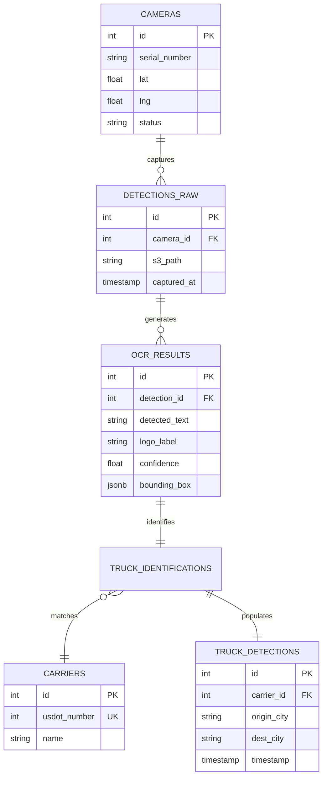

# Design Spec: Enhanced City Selection & Platform-Scale ER Diagram

## 1. Overview
This specification covers two main enhancements for the Genlogs Portal:
1.  **Dynamic City Selection:** Transitioning from a limited static list of US cities to a dynamic geocoding system that supports any US city.
2.  **Expanded ER Diagram:** Complementing the current database schema to represent the entire Genlogs platform, including camera infrastructure, raw detections, and OCR processing.

## 2. Dynamic City Selection (Frontend)

### 2.1 Technical Approach
- **API:** Use Nominatim (OpenStreetMap) for free, no-key geocoding.
- **URL:** `https://nominatim.openstreetmap.org/search?format=json&q={query}&countrycodes=us&limit=5`
- **Logic:**
    - Debounced search as the user types in the Origin/Destination fields.
    - Fetch city name, latitude, and longitude.
    - Update `useCarrierSearch` to handle coordinates dynamically.
    - Maintain a local cache of searched cities to avoid redundant API calls and support the `RouteMap` visualization.

### 2.2 UI/UX Improvements
- Replace `<datalist>` with a custom autocomplete dropdown for better control over dynamic loading states.
- Show a "Searching..." indicator while fetching suggestions.
- Ensure the selected city is stored with its coordinates to keep the `RouteMap` functional without relying on `CITY_DB`.

## 3. Platform-Scale ER Diagram (Backend/System Design)

### 3.1 New Entities & Schema
The current schema is an "Analytical Tier" MVP. The full platform requires a "Source Tier" and "Processing Tier".

**New Tables:**
- `cameras`: Tracks the physical edge devices.
    - `id` (PK), `serial_number` (Unique), `lat`, `lng`, `location_name`, `status`.
- `detections_raw`: Metadata for every image captured.
    - `id` (PK), `camera_id` (FK), `s3_path`, `captured_at`, `status` (pending/processed/error).
- `ocr_results`: Results from Logo/Plate detection workers.
    - `id` (PK), `detection_id` (FK), `detected_text`, `logo_label`, `confidence`, `bounding_box` (JSONB).
- `truck_identifications`: The result of matching OCR text to our `carriers` database.
    - `id` (PK), `detection_id` (FK), `carrier_id` (FK), `confidence_score`.

### 3.2 Revised ER Diagram (Mermaid)

## 4. Success Criteria
- [ ] Users can type any US city and see suggestions.
- [ ] Selecting a city correctly updates the map with its coordinates.
- [ ] `docs/ARCHITECTURE_DIAGRAMS.md` reflects the full platform schema.
- [ ] `backend/app/db/schema.sql` is updated with the proposed platform tables.

## 5. Implementation Plan
1.  **Phase 1: ER Diagram Update**
    - Update documentation and SQL schema.
2.  **Phase 2: Frontend Geocoding**
    - Implement Nominatim fetch logic.
    - Create dynamic autocomplete component.
    - Update `useCarrierSearch` hook.
3.  **Phase 3: Validation**
    - Verify map updates correctly with "any" city.
    - Ensure backend still returns data for valid routes.
